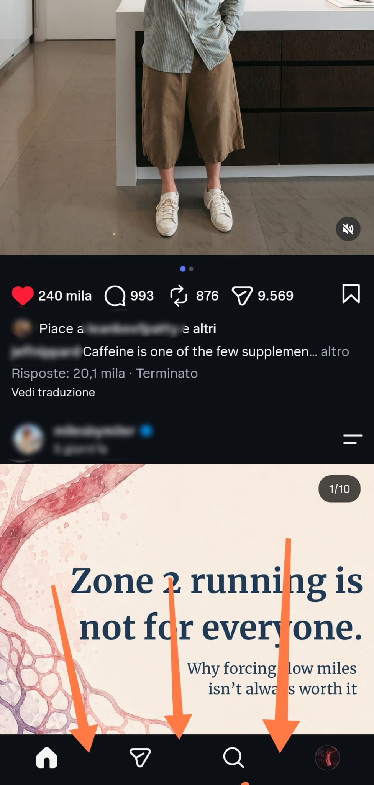

<div align="center">
<p align="center">
  
</p>

  <h1>Instagram Distractions Remover</h1>
  <p><strong>Automated local build tool to remove reels, scrolling, homepage feed, and recommendations from Instagram using ReVanced CLI.</strong></p>

  <p>
    <a href="https://github.com/ReVanced"></a>
    <a href="https://adoptium.net/"></a>
    <a href="https://www.android.com/"></a>
  </p>

</div>

---

## What is it?
Lightweight automation script for Windows 11 designed to build a modified, distraction-free version of the official Instagram app using **ReVanced CLI**.

### Interface Preview:
<div align="center">
  
  <p><em>Clean home feed with no Reels tab.</em></p>
</div>

## Key Features
- **Disable Reels Scrolling & Navigation:** Removes the dedicated Reels tab and blocks endless vertical swiping.
- **Strict Following Feed:** Limits home feed content to profiles you explicitly follow.
- **Zero Bloat:** Strips out forced suggested content and tracking query parameters.

---

## Prerequisites
Before running the builder, ensure your environment meets the following requirements:
1. **Windows 10+**
2. **Java JDK 17 (LTS):** Recommended build is [Eclipse Temurin 17](https://adoptium.net/).<br>
         └ *Make sure to check "Add to PATH" and "Set JAVA_HOME variable" during installation.*

---

## Quick Start Guide

### Step 1: Get the Project Files
Choose one option:

A. **As a ZIP**: Download and extract it anywhere on your PC, then open the extracted folder.<br>
B. **Using Git**: Clone the repo and navigate into the project directory: 
```bash
git clone https://github.com/baronetti/instagram-distraction-remover.git
cd instagram-distraction-remover
```
### Step 2: Download Required Files
Place the following files directly inside your workspace folder:

1. **ReVanced CLI:** Download the latest revanced-cli-x.x.x-all.jar from [ReVanced CLI Releases](https://github.com/ReVanced/revanced-cli/releases) and rename it to `cli.jar`.
2. **Target Instagram APK:** Download a clean .apk version (arm64-v8a) from [APKMirror](https://www.apkmirror.com/) and rename it to `instagram.apk`.<br>
          └ *Make sure it's a .apk, not a .apkm (bundle)*

In the folder you should now have: `cli.jar`, `instagram.apk`, and `builder.bat`.

### Step 3: Run the Automation Script
Execute `builder.bat`

The script will automatically:
- Fetch the latest patch profiles directly from ReVanced API.
- Decompile, patch, and recompile the binary.
- Self-sign the package for seamless deployment.
- Clean up all temporary files automatically.

### Step 4: Installation on Android
1. Transfer `instagram-patched.apk` to your phone (e.g. via USB, Telegram, Google Drive...).<br>
2. Uninstall the stock Instagram app from your device (required due to different signing certificates).<br>
3. Open `instagram-patched.apk` on your phone and allow installation from unknown sources.<br>
4. Log in and enjoy a distraction-free experience.<br>

---
## How to Update in the Future

When Instagram releases new features or older builds expire, updating your patched app takes less than a minute:

1. **Download New Base APK:** Get the latest stock Instagram `.apk` (arm64-v8a) from [APKMirror](https://www.apkmirror.com/) and replace the existing `instagram.apk` in your folder.
2. **Re-run Automation:** Execute `builder.bat`. The script automatically pulls the newest patch definitions and builds an updated `instagram-patched.apk`.
3. **In-Place Update:** Transfer `instagram-patched.apk` to your Android device and install it directly over the existing app.

> As long as you keep the generated `instagram-patched.keystore` file in your build directory, Android recognizes the same signature. You **will not need to uninstall the app or log in again**.

---

## Disclaimer
This project is an independent build utility and is not affiliated, authorized, maintained, sponsored, or endorsed by Meta Platforms, Inc. or ReVanced. This tool is intended strictly for personal educational use.
